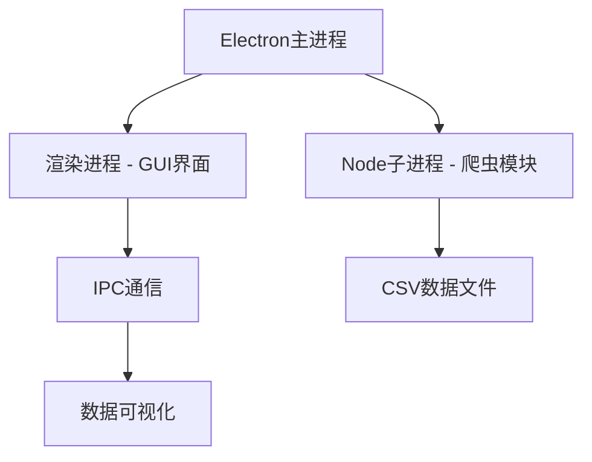

# SUES GPA Analyzer

上海工程技术大学GPA分析工具 - Electron版本

## 项目介绍

本项目是基于Electron重构的上海工程技术大学GPA分析工具，可以自动从培养方案完成情况爬取课程数据，并提供GPA规划和重修建议功能。

## 功能特性

- 自动化登录教务系统
- 爬取培养方案完成情况数据
- GPA计算与分析
- 重修课程推荐
- 可视化数据展示

## 技术架构



### 技术栈

- **主框架**: Electron 28.x
- **UI框架**: HTML/CSS/JavaScript
- **爬虫引擎**: Playwright 1.45
- **数据处理**: PapaParse 5.4 + math.js
- **配置管理**: INI文件存储

## 项目结构

```
electron-app/
├── main.js                # Electron主进程
├── package.json           # 项目配置
├── src/
│   ├── renderer/          # 渲染进程
│   │   └── preload.js     # 预加载脚本
│   └── crawler/           # 爬虫模块
│       ├── crawler.js     # 爬虫主逻辑
│       └── config.json    # 爬虫配置
├── public/                # 静态资源
│   └── index.html         # 主页面
└── courses.csv            # 课程数据文件
```

## 安装与运行

### 环境要求

- Node.js 16.x 或更高版本
- Windows/macOS/Linux 操作系统

### 安装步骤

1. 克隆项目代码：
   ```bash
   git clone <repository-url>
   cd sues-gpa-analyzer
   ```

2. 安装依赖：
   ```bash
   npm install
   ```

3. 启动应用：
   ```bash
   npm start
   ```

### 开发调试

```bash
# 启动开发模式
npm run dev

# 构建可执行文件
npm run build
```

## 使用说明

1. 启动应用后，在登录界面输入学号、密码和培养方案URL
2. 点击"登录系统"按钮进入GPA分析界面
3. 在GPA分析界面点击"获取数据"按钮开始爬取数据
4. 爬取完成后，应用会自动分析GPA并提供重修建议

## 爬虫模块说明

爬虫模块使用Playwright实现教务系统的自动化操作：

1. 第一次登录：输入用户名密码
2. 第二次登录：处理验证码等安全验证
3. 数据爬取：提取课程信息并保存为CSV文件

## 数据格式

爬取的课程数据保存为CSV格式，包含以下字段：
- course_name: 课程名称
- course_code: 课程代码
- course_semester: 开课学期
- course_attribute: 课程属性
- course_weight: 学分
- course_score: 成绩
- course_gpa: 绩点
- pass: 是否通过

## 注意事项

1. 请确保网络连接稳定
2. 部分教务系统操作需要手动完成（如滑块验证）
3. 请妥善保管个人登录信息
4. 本工具仅供学习交流使用，请遵守学校相关规定

## 开发计划

- [x] 项目架构设计
- [x] Electron基础框架搭建
- [x] 爬虫模块移植
- [x] GUI界面重构
- [x] 数据处理功能实现
- [x] 系统集成测试
- [x] 打包发布

## 用户信息存储

用户信息现在保存在INI格式的配置文件中，位于程序运行目录中，文件名为`user-info.ini`。这种格式比之前的electron-store更轻量且易于理解。

## 打包说明

在Windows系统上打包应用时，可能需要以管理员权限运行命令提示符来避免权限问题。使用以下命令进行打包：

```bash
npm run build
```

打包后的可执行文件将位于`dist`目录中。

## 许可证

MIT License

## 作者

Folklore25
